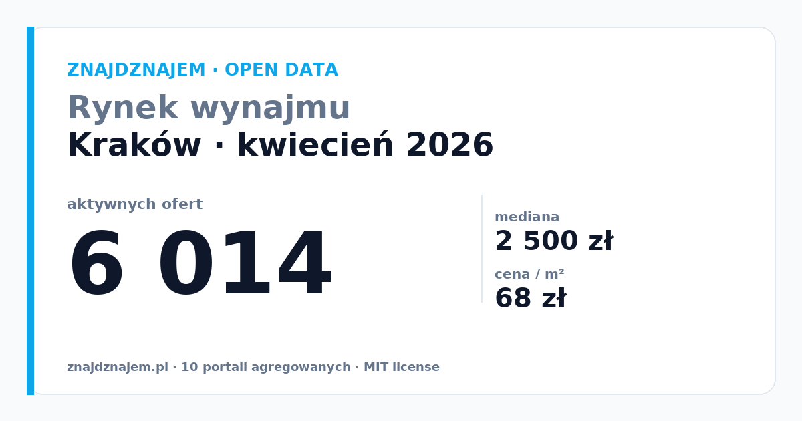

# Rynek wynajmu w Krakowie — raport kwiecień 2026

<!--

-->

> **Open data z 10 portali rental** · ZnajdzNajem · MIT license · wolno cytować

## Headlines (tweetable)

- **6 014** aktywnych ofert wynajmu w Krakowie w kwietniu 2026
- Mediana: **2 500 zł/mies.** · cena za m²: **68 zł**
- Najwięcej ofert w widełkach **2 500-2 999 zł**
- Najtańsza dzielnica: **Nowa Huta** · najdroższa: **Stare Miasto**

## Streszczenie

W kwietniu 2026 na rynku wynajmu w Krakowie odnotowaliśmy 6 014 aktywnych ofert wśród 7 tysięcy ogłoszeń z 10 największych portali. Mediana ceny to 2 500 zł miesięcznie.

Dane są agregatem publicznych ogłoszeń z OLX, Otodom, Gratka, Morizon i 6 innych portali. Wszystkie liczby są dostępne jako open data w repozytorium GitHub (patrz sekcja [Dane źródłowe](#dane-źródłowe)).

## Szczegółowe statystyki

| Wskaźnik | Wartość |
|---|---|
| Aktywne oferty | 6 014 |
| Mediana ceny miesięcznej | 2 500 zł |
| Średnia cena za m² | 68 zł |
| Najczęstsze widełki cenowe | 2 500-2 999 zł |
| Najtańsza dzielnica | Nowa Huta |
| Najdroższa dzielnica | Stare Miasto |
| Nowych ofert wczoraj | 13 |

## Co to znaczy dla najemców

Przy medianie 2 500 zł miesięcznie w Krakowie, najemca z budżetem 2 500-2 999 zł ma dziś do dyspozycji największą pulę ofert. Jeśli Twój budżet jest powyżej mediany, liczba dostępnych mieszkań maleje, ale konkurencja o nie również jest niższa. Warto śledzić alerty — dobre oferty w górnej połowie rozkładu znikają w ciągu 24-72h od publikacji.

Pełną mapę cen z per-dzielnicowym rozbiciem można obejrzeć tutaj:  
→ https://znajdznajem.pl/krakow/mapa-cen

## Co to znaczy dla wynajmujących

Jeśli wynajmujesz mieszkanie w Krakowie, porównaj swoją cenę z medianą (2 500 zł) oraz z medianą per m² (68 zł). Ogłoszenia wycenione o >15% powyżej mediany wymagają średnio 3-4x dłuższego czasu na znalezienie najemcy (na podstawie danych o czasie życia ogłoszeń).

## Metodologia

- **Źródła danych**: 10 publicznych portali ogłoszeniowych (patrz [sources.js](https://github.com/Maciek-roboblog/znajdznajem-open-data/blob/main/methodology.md))
- **Aktywna oferta**: widoczna przez scraper w ostatnich 60 dniach, nie oznaczona jako usunięta, nie zduplikowana (pHash + adres+cena+metraż)
- **Cadence**: snapshot tygodniowy (poniedziałek 06:00 Europe/Warsaw)
- **Dedup**: perceptual image hash ≤6 + normalized adres

Pełna metodologia: <https://github.com/Maciek-roboblog/znajdznajem-open-data/blob/main/methodology.md>

## Dane źródłowe

- **CSV**: `data/weekly/2026-W04/krakow.csv` w repo
- **JSON**: `data/weekly/2026-W04/krakow.json`
- **Live dashboard**: https://znajdznajem.pl/krakow/raport
- **Darmowy alert o nowych ofertach**: https://znajdznajem.pl/krakow/nowe-oferty

## Kontakt prasowy

- **Email**: admin@znajdznajem.pl
- **Custom data cuts**: dostępne dla dziennikarzy i badaczy (patrz [PRESS.md](https://github.com/Maciek-roboblog/znajdznajem-open-data/blob/main/PRESS.md))

## Licencja

MIT — wolno cytować, forkować, remixować. Preferowana atrybucja: 
> ZnajdzNajem open data (<https://github.com/Maciek-roboblog/znajdznajem-open-data>)

---

*Raport wygenerowany automatycznie 2026-04-24T05:38:31 przez pipeline Jenkins `znajdznajem/marketing-weekly`.*
